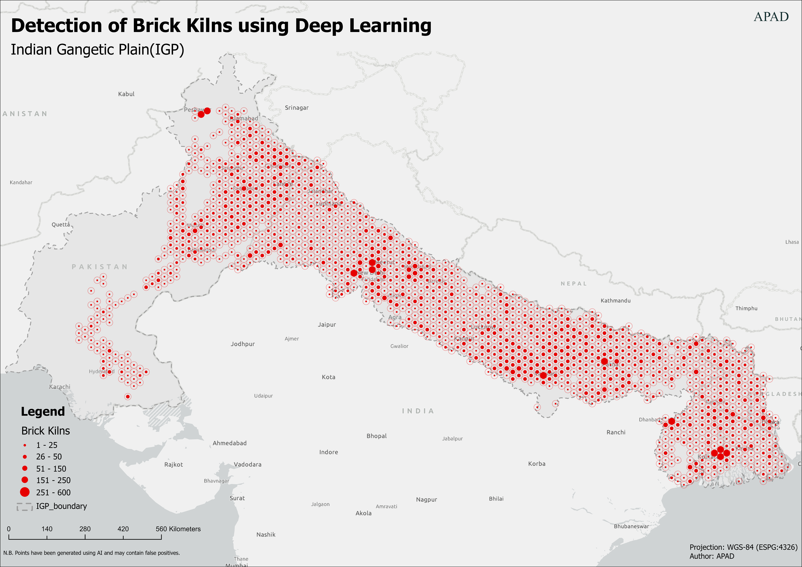
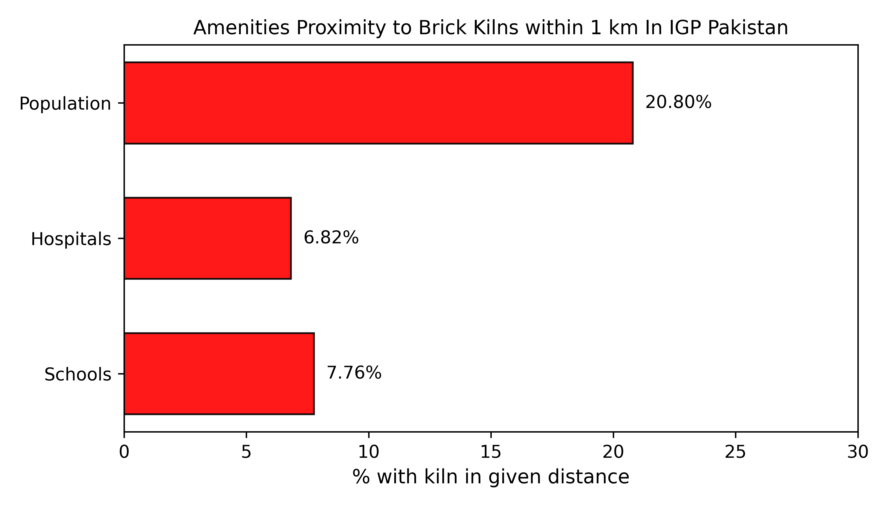

# Brick Kilns in IGP Region Using AI

This repository provides a comprehensive geospatial analysis of brick kiln operations in Indo-Gangetic Plain (IGP)-region (Bangladesh, India, and Pakistan) , focusing on their environmental and public health impacts. Using low-resolution satellite imagery, we have mapped and analyzed brick kiln sites, estimating their production and emissions. This dataset represents a pioneering effort to understand the spatial distribution of brick kilns and their contribution to air pollution in the region.

---

## **Table of Contents**

1. [Overview](#overview)  
2. [Brick Production Calculation](#brick-production-calculation)  
   - [Step 1: Total Production for "n" Kilns](#step-1-total-production-for-n-kilns)  
   - [Step 2: Daily Production per Kiln](#step-2-daily-production-per-kiln)  
   - [Updated Production & Emissions Calculation](#updated-production--emissions-calculation)  
3. [File Structure](#file-structure)  
   - [Main Dataset](#1-main-dataset)  
   - [Estimates Dataset](#2-estimates-dataset)  
4. [Funding Sources](#funding-sources)  
5. [Distribution Density](#distribution-density)  
6. [Citation](#citation)

---

## **Overview**

This dataset is the first open sourced geospatial mapping of brick kiln sites in the IGP region, providing invaluable insights into the distribution and environmental impact of these sites. Brick kilns are significant contributors to air pollution, and their emissions pose severe public health risks. This repository includes:

- **Precise geolocation of brick kilns**, standardized in CRS EPSG:4326 (WGS 84).
- **Preliminary emissions estimates** for pollutants such as PM10, PM2.5, NOx, and SOx.
- **Exposure risk assessments**, including proximity to sensitive areas such as schools, hospitals, and residential populations within a 1 km radius of each kiln.

---

## **Brick Production Calculation**

### **Step 1: Total Production for "n" Kilns**

Based on the paper _"Health risk assessment of emissions from brick kilns in Tando Hyder, Sindh, Pakistan using the AERMOD dispersion model"_:

- **18,000 kilns** produce **45 billion bricks annually**.
- **11,277 kilns** (extracted for our analysis):

$$
\text{Total production for 11,277 kilns} = \left(\frac{45\ \text{billion bricks}}{18,000\ \text{kilns}}\right) \times 11,277 = 28.293\ \text{billion bricks/year}
$$

---

### **Step 2: Daily Production per Kiln**

- **Annual production per kiln**:
  
$$
\frac{28.293\ \text{billion bricks}}{11,277\ \text{kilns}} = 2.51\ \text{million bricks/kiln/year}
$$

- **Daily production per kiln** (assuming 365 operational days):

$$
\frac{2.51\ \text{million bricks}}{365\ \text{days}} = 6,877\ \text{bricks/day}
$$

---

### **Updated Production & Emissions Calculation**

#### Seasonal Production

Given that brick kilns operate for approximately **215 days per year**, the updated calculations for daily and seasonal production are as follows:

1. **Daily Brick Production per Kiln**:

$$
\frac{0.65 \times 45\ \text{billion bricks}}{11,277\ \text{kilns} \times 215\ \text{days}} \approx 12,068\ \text{bricks/day}
$$

2. **Total Daily Brick Weight per Kiln**:

$$
12,068\ \text{bricks/day} \times 3\ \text{kg/brick} = 36,204\ \text{kg/day}
$$

#### Pollutant Emissions

Let $\(E_i\)$ represent the emission factor for pollutant $\(i\)$ in $\(g/kg\)$. Emissions for each pollutant are calculated as follows:

- **Daily Emissions $\(D_i\)$**: 

$$
D_i = E_i \times 36,204\ \text{kg/day}
$$

- **Seasonal Emissions $\(S_i\)$**:

$$
S_i = D_i \times 215
$$

Pollutants analyzed: PM2.5, PM10, NOx, and SOx.

---

## **File Structure**

### **1. Main Dataset**

This dataset includes the primary geolocation data of brick kilns in the region:

| **Column**       | **Description**                                          |
|------------------|----------------------------------------------------------|
| `id`             | Unique identifier for each brick kiln site               |
| `lat`            | Latitude in decimal degrees                              |
| `lon`            | Longitude in decimal degrees                             |
| `state`          | Administrative state/region                              |
| `type`           | Classification (e.g., FCBK or ZigZag kiln)              |
| `schools1km`     | Number of schools within a 1 km radius                   |
| `hosp1km`        | Number of hospitals within a 1 km radius                 |
| `pop1km`         | Estimated population within a 1 km radius                |

### **2. Estimates Dataset**

Supplementary dataset for production and emission estimates:

| **Column**        | **Description**                                          |
|-------------------|----------------------------------------------------------|
| `avg_bricks`      | Average daily kiln operation                             |
| `dailyprod(kg)`   | Daily production in kilograms                            |
| `seasonprod(kg)`  | Seasonal production in kilograms                         |
| `pm2.5d(kg)`      | Daily PM2.5 emissions in kilograms                       |
| `pm10d(kg)`       | Daily PM10 emissions in kilograms                        |
| `noxd(kg)`        | Daily NOx emissions in kilograms                         |
| `soxd(kg)`        | Daily SOx emissions in kilograms                         |
| `pm2.5s(kg)`      | Seasonal PM2.5 emissions in kilograms                    |
| `pm10s(kg)`       | Seasonal PM10 emissions in kilograms                     |
| `noxs(kg)`        | Seasonal NOx emissions in kilograms                      |
| `soxs(kg)`        | Seasonal SOx emissions in kilograms                      |

### **Data Formats**

The dataset is available in the following formats:

- **GeoJSON** (`.geojson`)
- **Shapefile** (`.shp`)
- **CSV** (`.csv`)

---

## **Funding Sources**

This project was funded by:

- **Amazon Web Services (AWS)**  
- **Smith School of Enterprise and The Environment, University of Oxford**

---
## **Special Gratitude**

We want to extend our heartfelt gratitude to @Doreen and her team for generously sharing valuable data that significantly contributed to our work on developing a model for detecting brick kilns. Your contributions have been instrumental in enabling us to expand data coverage for the whole of Indian Gangetic Plain (IGP). 

The brick kiln data for whole of India prepared by @Doreen and her team is accessible with the following link: [https://geo-ai.undp.org.in/](Access the Data) 

## **Distribution Density**

Below are two visualizations showing the distribution density of brick kilns in the IGP region:

**Figure 1: Brick Kiln Density Map**

**Figure 2: Proximity to Sensitive Areas (1km radius)**

---
