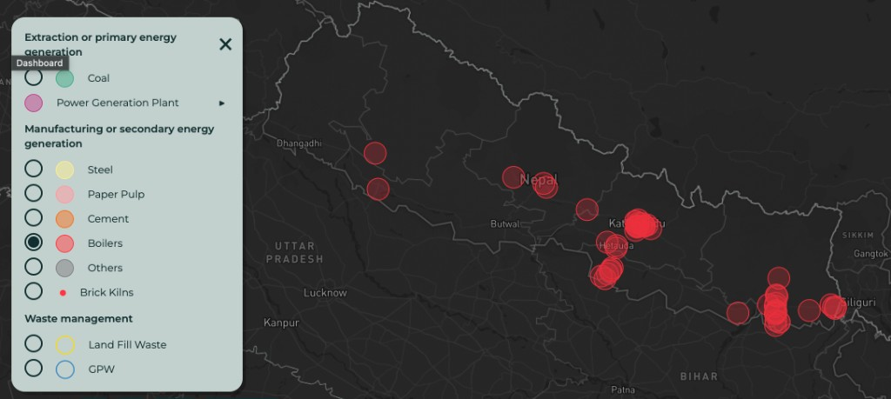

# **Industrial Boilers in the Indo-Gangetic Plain (IGP)**

---

# **Table of Contents**

1. [Overview](#overview)  
2. [Current File Snapshot](#current-file-snapshot)  
3. [Geographic Distribution](#geographic-distribution)  
4. [File Structure](#file-structure)  
5. [Citation](#citation)

---

## Overview

This folder supports an asset-level geospatial inventory of **industrial and commercial boiler installations** in the **Indo-Gangetic Plain (IGP)** study area, which includes **Bangladesh, India, Nepal, and Pakistan**. Boilers supply process heat, steam, or hot water and typically emit **particulate matter (PM)** and combustion gases such as **SO₂** and **NOₓ**, depending on fuel, burner configuration, and controls. **The APAD team detected these facilities using satellite imagery.**

The objective is to support:

- Air quality analysis  
- Emission inventory development  
- Regulatory assessment  
- Climate and health impact modelling  

The tabular file **`boilers.csv`** is structured to hold facility identity, coordinates, optional attributes (`type`, `fuel`, `status`, `capacity_tonnes`), pollutant-specific emission factors and annual tonnes (`emfpm10`, `pm10_t_yr`, etc.), and provenance (`source`). See [Current File Snapshot](#current-file-snapshot) for what is populated today.

---

## Current File Snapshot

The following summary reflects **`boilers.csv`** as delivered in this folder:

| Attribute | Value |
|-----------|--------|
| **Number of facilities** | 58 |
| **Country** | All records are **Nepal** (`country` = Nepal). |
| **Coordinates** | **lat** and **lon** are present for every facility (EPSG:4326, WGS 84). |
| **Latitude range** | Approximately **26.43°N** to **28.58°N** |
| **Longitude range** | Approximately **81.64°E** to **88.12°E** |
| **Name & region** | **name** and **region** (text locality / address context) are populated for each row. |

Companion files:

- **`boilers_address.csv`** — same facilities as two columns: enterprise name and address text.  
- **`boilers.geojson`** — point geometry with properties **`Name of Enterprise`** and **`Address of the Industry`** (coordinates as `[longitude, latitude]` per GeoJSON).  

These three files describe the **same 58 sites**; the CSV holds the extended schema for future capacity and emissions.

---

## Geographic Distribution

The map above is a screenshot from the APAD asset dashboard with **Boilers** selected in the manufacturing / secondary energy layer. It shows boiler-related points (red circles) across **Nepal**, with surrounding areas of **India** (e.g. Uttar Pradesh, Bihar, West Bengal / Siliguri corridor) for context.

Consistent with the point pattern in that map and the **`region`** field in **`boilers.csv`**, facilities are spread across:

- **Central Nepal** — notable concentration in and around the **Kathmandu** valley (**Kathmandu**, **Lalitpur**, **Bhaktapur**, Balaju, Patan, Banepa, and adjoining industrial pockets).  
- **Eastern Terai / Koshi** — clusters linked to **Jhapa**, **Sunsari**, **Morang**, **Biratnagar**, **Dharan**, and **Duhabi**–area localities.  
- **South-central Terai** — **Parsa**, **Bara**, **Birgunj**, **Jeetpur**, and similar districts.  
- **Other nodes** — e.g. **Hetauda** industrial area, **Pokhara**, **Baglung**, **Surkhet** (western Nepal), and **Saptari** (e.g. Gajendra Narayan Singh Industrial Estate).  

The inventory captures **diverse sectors** that rely on steam or heat (for example dairy and food processing, textiles, pharmaceuticals, metal working, plywood, tea, hotels, and feed)—reflecting typical boiler host sites.

---

## File Structure

### Available Formats

- **`boilers.csv`** — full attribute table (see columns below).  
- **`boilers_address.csv`** — columns **`Name of Enterprise`**, **`Address of the Industry`**.  
- **`boilers.geojson`** — `FeatureCollection` of points; properties match the address file.  

### Column Names (`boilers.csv`)

`id, name, lat, lon, type, fuel, region, country, status, capacity_tonnes, emfpm10, pm10_t_yr, emfpm25, pm25_t_yr, emfso2, so2_t_yr, emfnox, nox_t_yr, source`

### Column Description

| Field | Description |
|-------|-------------|
| id | Unique facility identifier (1–58 in the current file). |
| name | Facility / enterprise name. |
| lat, lon | GPS coordinates (WGS 84). |
| type | Boiler or facility category. |
| fuel | Primary fuel. |
| region | Administrative region, district, or free-text location string. |
| country | Country name. |
| status | Operational status. |
| capacity_tonnes | Capacity or annual throughput (tonnes/year or compatible measure). |
| emfpm10 | PM10 emission factor. |
| pm10_t_yr | Annual PM10 emissions (tonnes/year). |
| emfpm25 | PM2.5 emission factor. |
| pm25_t_yr | Annual PM2.5 emissions (tonnes/year). |
| emfso2 | SO₂ emission factor. |
| so2_t_yr | Annual SO₂ emissions (tonnes/year). |
| emfnox | NOₓ emission factor. |
| nox_t_yr | Annual NOₓ emissions (tonnes/year). |
| source | Data source or methodology note. |

### `boilers_address.csv`

| Field | Description |
|-------|-------------|
| Name of Enterprise | Facility name (matches **`name`** in the CSV). |
| Address of the Industry | Text address (aligned with **`region`** / location text). |

---

## Citation

If you use this dataset:

APAD (2025).  
*Industrial Boilers Dataset – Indo-Gangetic Plain (IGP).*  

### **License**

This dataset is released under:

- 
- 

You are free to use, share, remix, and build upon the data with attribution.
