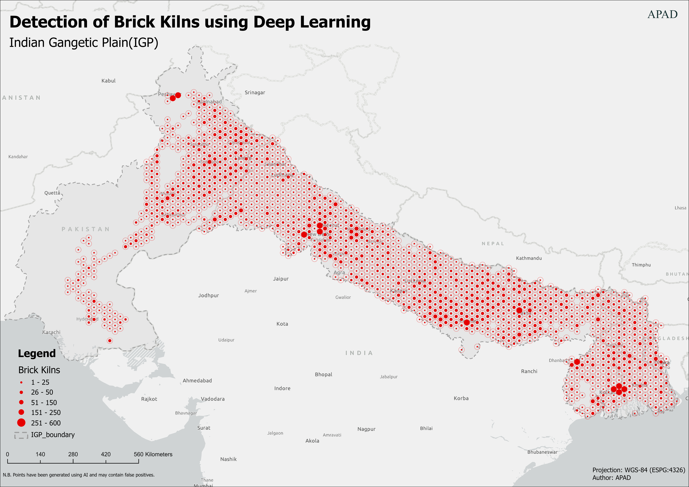
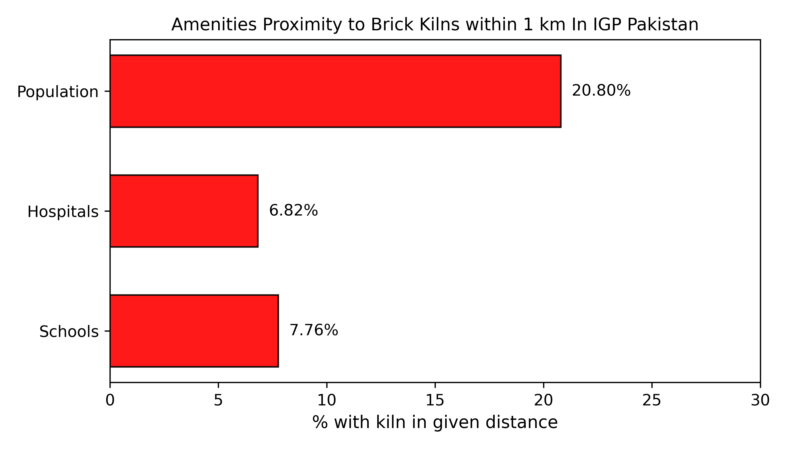

# **Brick Kilns in the Indo-Gangetic Plain (IGP) Identified Using AI**

This repository presents the first large-scale, AI-enabled geospatial mapping of brick kiln operations across the Indo-Gangetic Plain (IGP), covering Bangladesh, India, and Pakistan.  
Using deep learning applied to satellite imagery, we identify kiln locations, estimate production, and provide annualized emissions for major pollutants.  
This dataset offers vital insights into one of South Asia’s largest unregulated industrial contributors to air pollution.

---

# **Table of Contents**

1. [Overview](#overview)
3. [Brick Production Calculation](#brick-production-calculation)
4. [File Structure](#file-structure)
6. [Funding Sources](#funding-sources)
7. [Acknowledgments](#special-gratitude)
8. [Distribution Density](#distribution-density)
9. [Citation](#citation)

---

# **Overview**

This dataset provides:

* Geolocation of brick kilns (EPSG:4326, WGS 84)
* Emissions for PM₁₀, PM₂.₅, SO₂, NOₓ
* 1 km exposure analysis for sensitive sites

The dataset supports the findings published in:

### *Nature Scientific Data (2025)*

**Hamdani, M.S.A., Zakir, K., Kushwaha, N. et al.**
*Brick Kiln Dataset for Pakistan’s IGP Region Using AI.*[https://doi.org/10.1038/s41597-025-05148-9](https://doi.org/10.1038/s41597-025-05148-9)

### Zenodo Dataset (Open Access)

🔗 [https://doi.org/10.5281/zenodo.17897579](https://doi.org/10.5281/zenodo.17897579)

**Dashboard**

Explore the data interactively through our dashboard: [APAD Dashboard](https://apad.world/dashboard)

---

## **Brick Production Calculation**

| **Metric**                               | **Pakistan (PAK)** | **India (IND)**   | **Bangladesh (BAN)** |
| ---------------------------------------- | ------------------ | ----------------- | -------------------- |
| **Annual Production (national)**         | 45B bricks         | 250B bricks       | 15B bricks           |
| **Estimated Total Kilns**                | ~18,000            | ~1,000,000        | ~5,000               |
| **Kilns Identified in Dataset**          | 11,272             | 34,466            | 4,760                |
| **Annual Production (identified kilns)** | 28.18B             | 8.617B            | 14.28B               |
| **Daily Production per Kiln**            | 11,625 bricks/day  | 11,635 bricks/day | 13,778 bricks/day    |
| **Daily Brick Weight**                   | 36.204 tonnes      | 34.905 tonnes     | 41.334 tonnes        |
| **Operational Days**                     | 215                | 215               | 215                  |
| **Seasonal Weight Output per Kiln**      | **7,783 tonnes**   | **7,505 tonnes**  | **8,897 tonnes**     |

---

## **File Structure**

### **Available Formats**

* `.csv`
* `.geojson`
* `.xlsx`

---

## **1. Main Dataset**

| Field        | Description       |
| ------------ | ----------------- |
| `id`         | Kiln identifier   |
| `lat`, `lon` | GPS coordinates   |
| `type`       | Kiln type         |
| `state`      | Province / state  |
| `country`    | Country           |
| `status`     | Operational state |

---

## **2. Emission Datasets**

Separate datasets for **coal** and **biomass** fuel use.

| Field                  | Description           |
| ---------------------- | --------------------- |
| `capacity_tonnes`      | Production output     |
| `emfpm10`, `pm10_t_yr` | PM10 EF & emissions   |
| `emfpm25`, `pm25_t_yr` | PM2.5 EF & emissions  |
| `emfso2`, `so2_t_yr`   | SO₂ EF & emissions    |
| `emfnox`, `nox_t_yr`   | NOₓ EF & emissions    |
| `source`               | Methodology reference |

---

# **Folder Structure**

### **corrected/**

Cleaned & validated datasets for:

* India
* Pakistan

### **with_FPs/**

Full point-set (FPS) datasets:

* India
* Pakistan
* Bangladesh

---

## **Funding Sources**

This work was supported by:

* **Amazon Web Services (AWS)**
* **Smith School of Enterprise & the Environment (University of Oxford)**

---

### **Special Gratitude**

Special thanks to **@DozBoyd** and the UNDP GeoAI initiative for providing India-wide foundational kiln datasets.

Dataset: [https://geo-ai.undp.org.in/](https://geo-ai.undp.org.in/)

---

## **Distribution Density**

---

## **Citation**

If you use this repository:

### **Scientific Article**

> **Hamdani, M.S.A., Zakir, K., Kushwaha, N. et al.**
> *Brick Kiln Dataset for Pakistan’s IGP Region Using AI.*
> Scientific Data 12, 830 (2025).
> [https://doi.org/10.1038/s41597-025-05148-9](https://doi.org/10.1038/s41597-025-05148-9)

### **Dataset**

### **License**

This dataset is released under:

* 
* 

You are free to use, share, remix, and build upon the data with attribution.

