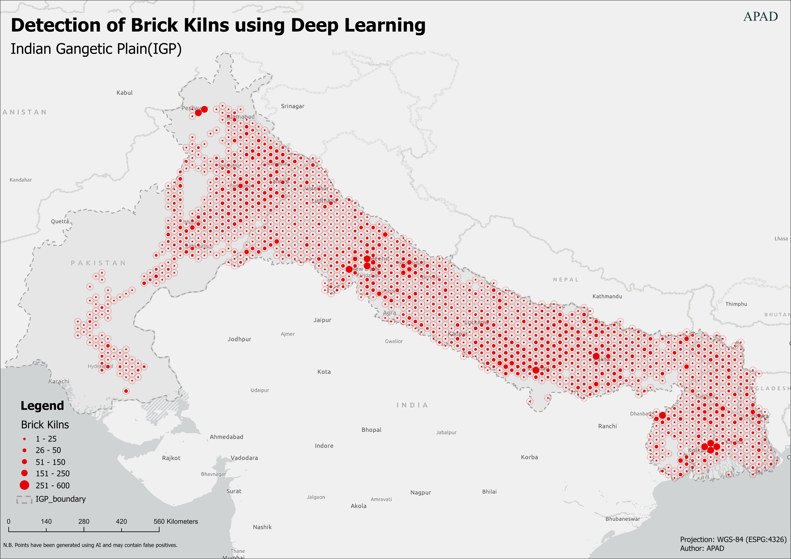
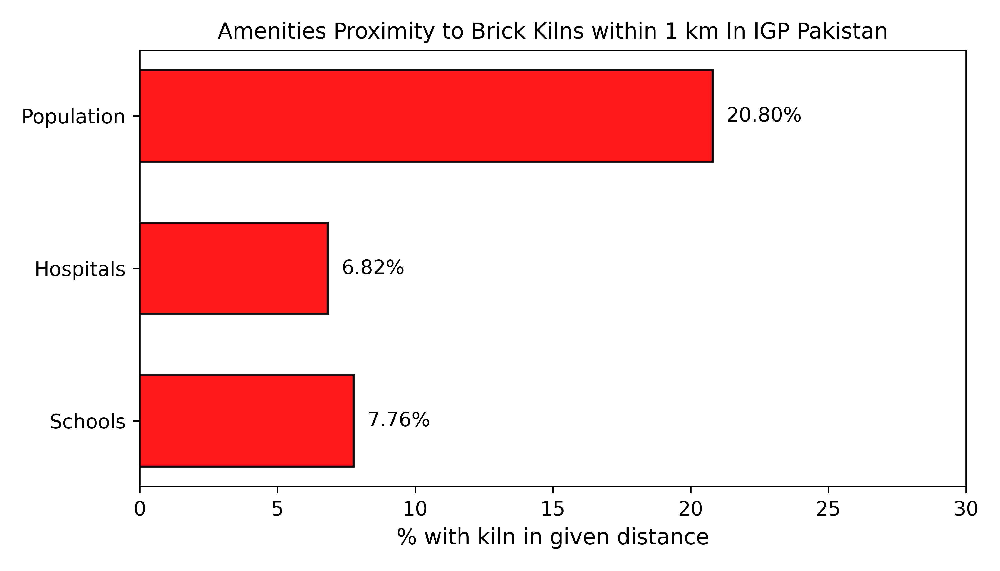

# **Brick Kilns in the Indo-Gangetic Plain (IGP) Identified Using AI**

This repository presents the first large-scale, AI-enabled geospatial mapping of brick kiln operations across the Indo-Gangetic Plain (IGP), covering Bangladesh, India, and Pakistan.  
Using deep learning applied to satellite imagery, we identify kiln locations, estimate production, and provide annualized emissions for major pollutants.  
This dataset offers vital insights into one of South Asia’s largest unregulated industrial contributors to air pollution.

---

# **Overview**

The dataset supports the findings published in:

### *Nature Scientific Data (2025)*

**Hamdani, M.S.A., Zakir, K., Kushwaha, N. et al.**
*Brick Kiln Dataset for Pakistan’s IGP Region Using AI.*[https://doi.org/10.1038/s41597-025-05148-9](https://doi.org/10.1038/s41597-025-05148-9)

### Zenodo Dataset (Open Access)

🔗 [https://doi.org/10.5281/zenodo.17897579](https://doi.org/10.5281/zenodo.17897579)

**Dashboard**

Explore the data interactively through our dashboard: [APAD Dashboard](https://apad.world/dashboard)

---

# **Folder Structure**

### **corrected/**

Cleaned & validated datasets for:

* India
* Pakistan

### **with_FPs/**

With some False_Positives datasets:

* India
* Pakistan
* Bangladesh

---

## **Funding Sources**

This work was supported by:

* **Amazon Web Services (AWS)**
* **Smith School of Enterprise & the Environment (University of Oxford)**

---

### **Special Gratitude**

Special thanks to **@DozBoyd** and the UNDP GeoAI initiative for providing India-wide foundational kiln datasets.

Dataset: [https://geo-ai.undp.org.in/](https://geo-ai.undp.org.in/)

---

## **Distribution Density**

---

## **Citation**

If you use this repository:

### **Scientific Article**

> **Hamdani, M.S.A., Zakir, K., Kushwaha, N. et al.**
> *Brick Kiln Dataset for Pakistan’s IGP Region Using AI.*
> Scientific Data 12, 830 (2025).
> [https://doi.org/10.1038/s41597-025-05148-9](https://doi.org/10.1038/s41597-025-05148-9)

### **Dataset**

### **License**

This dataset is released under:

* 
* 

You are free to use, share, remix, and build upon the data with attribution.

